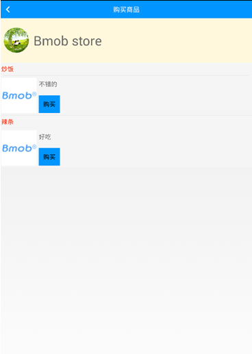
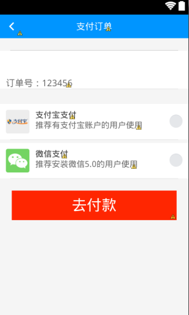
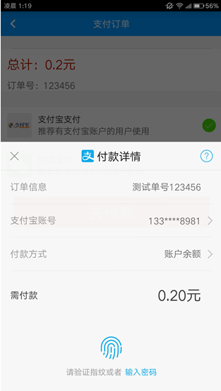
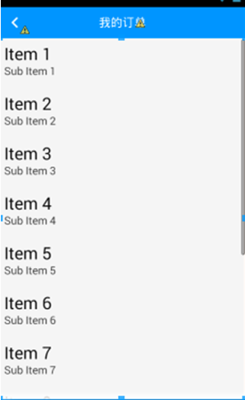
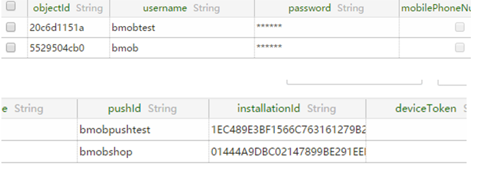
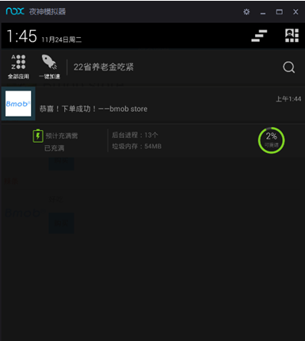
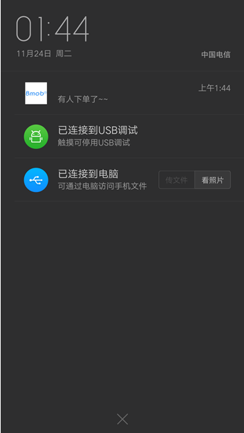

# Bmob-shop demo for Android文档
###[点我访问Bmob官网](http://www.bmob.cn/)
##2015年11月26日更新
* 改正部分错误
* 精简不必要的内容
***
#第一章 初识BMOB
###本小节主要讲解BMOB的登录及注册及后台数据库、自定义User类等应用.
#####1.首先新建一个项目:`BmobDemo`，包名设为`bmob.store.demo`，然后再建立如下包:
		bmob.store.demo.ui(存放ui主界面)

		bmob.store.demo.base(存放基础类)

		bmob.store.demo.fragment(存放fragment)

		bmob.store.demo.config(存放静态string字段)

		bmob.store.demo.bean(存放实体类)

		bmob.store.demo.adapter（存放适配器）  

		bmob.store.demo.utlis（存放常用工具类）

		bmob.store.demo.view（存放自定义view）
###1.1 导入bmob libs
`本demo版本：3.4.1`
#####下载最新的`android sdk`，并将`Bmob sdk_xx.jar`放入`workplace/BmobDemo/libs`下
###1.2 在BMOB官网后台新建一个应用,名为`Bmobshop`　
###1.3 接下来在`bmob.store.demo.config`包下新建一个类，名为`MyConfig`，将刚刚新建好的应用的APP_ID存放进去
		public static Static APP_ID="你的应用APP_ID";
###2.Base类
#####在.base包下新建一个类：`BaseFragmentActivity`，并且继承自`FragmentActivity`，因为在后面要使用到Fragment
		public abstract class BaseFragmentActivity extends FragmentActivity{
		public FragmentManager mfragmentManager;
		public FragmentTransaction mfragmentTransaction;
		protected void onCreate(Bundle arg0) {
		super.onCreate(arg0);
		setContentView(getLayoutViewID());
		findViews();
		setupViews();
		setLinstener();
		}
		public void back(View view){
		finish();
		}
		/**
		 *不含数据的activity跳转
		 *@param cla 需要跳转的类
	 	*/
		public void startAnimActivity(Class<?> cla) {
		this.startActivity(new Intent(this, cla));
		}
		/**
		 *含数据的activity跳转
		 *@param intent 含有bundle或extra的intent
		 */
		public void startAnimActivity(Intent intent) {
		this.startActivity(intent);
		}
		protected abstract int getLayoutViewID();
		protected abstract void findViews();
		protected abstract void setupViews();
		protected abstract void setLinstener();
		}
###3.UI界面
###3.1 在.ui包下新建一个类:`SplashActivity`
#####在layout文件夹下新建一个布局文件:`activty_splash`
#####布局内容：
		<?xml version="1.0" encoding="utf-8"?>
		<LinearLayout xmlns:android="http://schemas.android.com/apk/res/android"
		android:layout_width="match_parent"
		android:layout_height="match_parent"
		android:gravity="center"
		android:orientation="vertical" >
		<ImageView 
		android:layout_width="wrap_content"
		android:layout_height="wrap_content"
		android:src="@drawable/ic_launcher"/>
		</LinearLayout>
#####在`getLayoutViewID()`方法中返回该布局文件
		protected int getLayoutViewID() {
			return R.layout.activity_splash;
		}
#####`初始化Bmob SDK`：
		protected void findViews() {
			Bmob.initialize(this,MyConfig.APP_ID);
		}
###3.2 创建一个`自定义BmobUser`的实体类，在.bean包下新建类:`MyUser`，继承自`BmobUser`，并自定义一些属性
		public class MyUser extends BmobUser implements Serializable{
		private Integer age;//年龄
		private Boolean sex;//性别
		private BmobFile avator;//用于存放头像文件
		private Boolean is_openShop;//是否开了小店
		
		...setter and getter...
		}
#####需要说明的是上传Bmob后台所需的数据类型必须是`包装类`，比如`Integer`，`Boolean`等
#####这里没有写`userName`和`passWord`属性是因为这些都是BmobUser自带的，可以直接set和get
#####在`SplashActivity`中新建一个handler线程，用于`跳转主界面或登录界面`
		public static final int HOME =1;//主界面
		public static final int LOGIN = 2;//登录界面
		//handler线程
		Handler mHandler = new Handler(){
			public void handleMessage(Message msg) {
				super.handleMessage(msg);
				switch (msg.what) {
				case HOME:
					//跳转到主页
					startAnimActivity(MainActivity.class);
					finish();
					break;
				case LOGIN:
					//跳转到登录界面
					startAnimActivity(LoginActivity.class);
					finish();
					break;
				default:
					break;
				}
			}
		};
#####声明一个MyUser:`myuser`，然后判断是否为`null`,null为没有登录过。
		MyUser myuser;
		myuser = BmobUser.getCurrentUser(this,MyUser.class);
			if(myuser == null){
				mHandler.sendEmptyMessageDelayed(LOGIN,2000);
			}else{
				mHandler.sendEmptyMessageDelayed(HOME,2000);
			}
###3.3 登录界面
#####3.3.1新建一个布局文件:`activity_login.xml`

#####3.3.2在.ui包下新建类：`LoginActivity`
#####LoginActivity.java：
			public class LoginActivity extends BaseFragmentActivity implements OnClickListener{
				Button login_BtnLogin;
				TextView login_tvRegister,login_tvFound;
				EditText login_edUsername,login_edPassword;
		
			protected int getLayoutViewID() {
					return R.layout.activity_login;
			}
			protected void findViews() {
				login_tvFound = (TextView)findViewById(R.id.login_tvFound);
				login_tvRegister = (TextView)findViewById(R.id.login_tvRegister);
				login_BtnLogin = (Button)findViewById(R.id.login_BtnLogin);
				login_edUsername = (EditText)findViewById(R.id.login_edUsername);
				login_edPassword = (EditText)findViewById(R.id.login_edPassword);
			}
			protected void setLinstener() {
				login_BtnLogin.setOnClickListener(this);
				login_tvRegister.setOnClickListener(this);
			}
			protected void setupViews() {
				
			}
			public void onClick(View v) {
				switch (v.getId()) {
				case R.id.login_tvRegister:
						register();
					break;
				case R.id.login_BtnLogin:
						login();
					break;
				}
			}
			public void register(){
				startActivity(new Intent(LoginActivity.this, RegisterActivity.class));
			}
			public void login(){
				String getStrUsername = login_edUsername.getText().toString().trim();
				String getStrPassword = login_edPassword.getText().toString().trim();
				if(!getStrUsername.equals("")&&!getStrPassword.equals("")){
					final ProgressDialog pd = ProgressDialog.show(LoginActivity.this, "提示", "正在登陆。。。");
					MyUser myUser = new MyUser();
					myUser.setUsername(getStrUsername);
					myUser.setPassword(getStrPassword);
					myUser.login(LoginActivity.this, new SaveListener() {
						public void onSuccess() {
							pd.dismiss();
							//跳转到主界面
							startAnimActivity(MainActivity.class);
							finish();
							//还可以显示欢迎toast
						}
						public void onFailure(int code, String message) {
							pd.dismiss();
							//可根据code判断是用户密码错误还是网络连接失败
							ToastFactory.show(LoginActivity.this, "登录失败！账户密码错误！");
						}
					});
				}
			}
		}

#####3.修改androidMainfest.xml文件设置SplashActivity为主活动，代码如下：
		<activity
	            android:name="bmob.store.demo.ui.SplashActivity"
	            android:label="@string/app_name" >
	            <intent-filter>
	                <action android:name="android.intent.action.MAIN" />
	
	                <category android:name="android.intent.category.LAUNCHER" />
	            </intent-filter>
		</activity>
#####4.注册界面：RegisterActivity,布局界面和登录是一样的。
	public class RegisterActivity extends BaseFragmentActivity{

	Button BtnRegister;
	protected int getLayoutViewID() {
		return R.layout.activity_register;
	}
	
	protected void findViews() {
		BtnRegister = (Button)findViewById(R.id.register_BtnRegister);
	}
	
	protected void setupViews() {
		
	}

	protected void setLinstener() {
		BtnRegister.setOnClickListener(new OnClickListener() {
			public void onClick(View v) {
				myHandler.sendEmptyMessage(1);
			}
		});
	}
	Handler myHandler = new Handler(){
		public void handleMessage(Message msg) {
			super.handleMessage(msg);
			switch (msg.what) {
			case 1:
				createUser();
				break;
			}
		}
	};
	//创建一个user
	public void createUser(){
		ToastFactory.showProgressDialog(this,"正在注册...");
		MyUser mu = new MyUser();
		mu.setUsername("bmobtest");
		mu.setPassword("123456");
		mu.setAge(22);
		mu.setIs_openShop(false);
		mu.setSex(false);
		mu.signUp(this,new SaveListener() {
			public void onSuccess() {
				saveInstallationInfo();
				//可以先注释掉上面的方法直接跳转到主界面
			}
			public void onFailure(int arg0, String arg1) {
				ToastFactory.dismissProgressDialog();
				ToastFactory.show(RegisterActivity.this,"注册失败");
			}
		});
	}
	//保存installation信息
	//本方法可以先不写，在讲到推送地方会进行说明
	public void saveInstallationInfo(){
		BmobQuery<MyBmobInstallation> query = new BmobQuery<MyBmobInstallation>();
		query.addWhereEqualTo("installationId", BmobInstallation.getInstallationId(this));
		query.findObjects(this, new FindListener<MyBmobInstallation>() {
		    public void onSuccess(List<MyBmobInstallation> object) {
		        if(object.size() != 0){
		        	//有了bmobinstallation
		            MyBmobInstallation mbi = object.get(0);
		            mbi.setPushId("bmobpushtest");
		            mbi.update(RegisterActivity.this,new UpdateListener() {
		                public void onSuccess() {
		                	ToastFactory.dismissProgressDialog();
		    				ToastFactory.show(RegisterActivity.this,"注册成功！");
		    				finish();
		                }
		                public void onFailure(int code, String msg) {
		                }
		            });
		        }
		    }
		    public void onError(int code, String msg) {
		    }
		});
	}
	}
#####在`AndroidMainfest.xml`添加网络及相关权限
	<uses-permission android:name="cn.bmob.permission.push"/><!-- 添加自定义的权限-->
    <uses-permission android:name="android.permission.READ_LOGS" />
    <uses-permission android:name="android.permission.INTERNET" />
    <uses-permission android:name="android.permission.READ_PHONE_STATE" />
    <uses-permission android:name="android.permission.WAKE_LOCK" />
    <uses-permission android:name="android.permission.RECEIVE_BOOT_COMPLETED" />    
    <uses-permission android:name="android.permission.WRITE_EXTERNAL_STORAGE" />
    <uses-permission android:name="android.permission.VIBRATE" />
    <uses-permission android:name="android.permission.ACCESS_NETWORK_STATE" />
    <uses-permission android:name="android.permission.ACCESS_WIFI_STATE" />
    <uses-permission android:name="android.permission.RECEIVE_USER_PRESENT" />
###5.搭建MainActivity
###内容：`3个fragment`
#####布局文件
#####`activity_main.xml：`
	<?xml version="1.0" encoding="utf-8"?>
	<LinearLayout xmlns:android="http://schemas.android.com/apk/res/android"
    android:layout_width="match_parent"
    android:layout_height="match_parent"
    android:orientation="vertical" >
    <include
        android:id="@+id/main_layoutActionBar"
        layout="@layout/layout_actionbar"/>
    <FrameLayout 
        android:layout_width="match_parent"
        android:layout_height="0dp"
        android:id="@+id/main_fragmentContainer"
        android:layout_weight="1"
        ></FrameLayout>
    <include 
        android:id="@+id/main_layoutBottom"
        layout="@layout/layout_mainbottom"/>
	</LinearLayout>
#####6.在.Base包下新建一个类:`BaseFragment`，代码如下：
	public abstract class BaseFragment extends Fragment{
	
	public Context context;
	public View contentView;
	public void onCreate(Bundle savedInstanceState) {
		super.onCreate(savedInstanceState);
		context = getActivity();
	}
	
	public View onCreateView(LayoutInflater inflater, ViewGroup container,
			Bundle savedInstanceState) {
		contentView = inflater.inflate(getLayoutID(), null);
		findViews();
		return contentView;
	}
	public void onStart() {
		super.onStart();
		setupViews();
		setListener();
	}
	protected abstract int getLayoutID();
	protected abstract void findViews();
	protected abstract void setupViews();
	protected abstract void setListener();
	}
###第一个fragment
#####1.在`layout文件夹`新建一个xml：`fragment_shop`
	<?xml version="1.0" encoding="utf-8"?>
	<LinearLayout xmlns:android="http://schemas.android.com/apk/res/android"
    android:layout_width="match_parent"
    android:layout_height="match_parent"
    android:gravity="center_horizontal"
    android:padding="20dp"
    android:orientation="vertical" >
	<Button 
	    style="@style/baseBtn"
	    android:background="@color/color_blue_deep"
	    android:id="@+id/shop_BtnBuy"
	    android:text="购买商品" />   
	     <!-- background最好是一个selector -->
	<Button 
	  style="@style/baseBtn"
	    android:text="我的小店"
	     android:id="@+id/shop_BtnShop"
	    android:background="@color/color_red" />
	<Button 
	    style="@style/baseBtn"
	    android:id="@+id/shop_BtnOrder"
	    android:background="@color/color_green_light"
	    android:text="我的订单"  />
	<Button 
	    style="@style/baseBtn"
	    android:id="@+id/shop_BtnAddGoods"
	    android:background="@color/color_orange"
	    android:text="添加商品"  />
	<Button 
	    style="@style/baseBtn"
	    android:id="@+id/shop_BtnLogout"
	    android:background="@color/color_orange"
	    android:text="登出"  />
	</LinearLayout>
#####效果：

#####提醒：最好把`dp`、`sp`等常量放入`dimens.xml`下，以及常用的`布局风格`放入`styles.xml`,常用的`String常量`让入`strings.xml`，还有常用的颜色放入`colors.xml`
#####2.在.fragment包下新建3个类，名为`ShopFragment`、`TalkFragment`、`BBSFragemnt`，都继承自`BaseFragment`。
#####ShopFragment：
	public class ShopFragment extends BaseFragment{
	
	Button shop_buy,shop_myShop,shop_myOrder,shop_addGoods,logout;
	private static final int BUY_GOODS = 100;
	private static final int ORDER = 200;
	MyUser u ;
	protected int getLayoutID() {
		return R.layout.fragment_shop;
	}
	protected void findViews() {
		Log.i("shopFragment","shop_Fragment");
		u = BmobUser.getCurrentUser(getActivity(), MyUser.class);
		shop_buy = (Button)contentView.findViewById(R.id.shop_BtnBuy);
		shop_myShop = (Button)contentView.findViewById(R.id.shop_BtnShop);
		shop_myOrder = (Button)contentView.findViewById(R.id.shop_BtnOrder);
		shop_addGoods = (Button)contentView.findViewById(R.id.shop_BtnAddGoods);
		logout = (Button)contentView.findViewById(R.id.shop_BtnLogout);
	}
	
	protected void setupViews() {
		
	}
	
	protected void setListener() {
		shop_buy.setOnClickListener(this);
		shop_myShop.setOnClickListener(this);
		shop_myOrder.setOnClickListener(this);
		shop_addGoods.setOnClickListener(this);
		logout.setOnClickListener(this);
	}
	}
#####3.创建MainActivity
#####MainActivity.java:
	public class MainActivity extends BaseFragmentActivity {
	
	//底部按钮及布局
	private LinearLayout layout_Bottom;
	//3个Button
	private Button[] btns= new Button[3];
	//3个fragments
	private Fragment[] fragments = new Fragment[3];
	//actionBar布局
	private LinearLayout layout_actionBar;
	//actionBar上面的标题
	private TextView text_actionBar;
	//标题内容
	private String[] actionBarStr = {"商城","会话","论坛"};
	//当前fragment的索引
	private int index = 0;//当前的索引值
	private int lastindex = 0;//上一个索引值

	protected int getLayoutViewID() {
		return R.layout.activity_main;
	}
		
	protected void findViews() {
		mfragmentManager = getSupportFragmentManager();
		mfragmentTransaction = mfragmentManager.beginTransaction();
		//actionbar设置
		layout_actionBar = (LinearLayout)findViewById(R.id.main_layoutActionBar);
		text_actionBar = (TextView)layout_actionBar.findViewById(R.id.actionBar_showText);
		//底部按钮获取
		layout_Bottom = (LinearLayout)findViewById(R.id.main_layoutBottom);
		btns[0] = (Button)layout_Bottom.findViewById(R.id.main_btnShop);
		btns[1] = (Button)layout_Bottom.findViewById(R.id.main_btnTalk);
		btns[2] = (Button)layout_Bottom.findViewById(R.id.main_btnBBS);
	}
	
	protected void setupViews() {
		//初始化第一个fragment和按钮以及actionBar
		 if (null == fragments[0]){
			 fragments[0] = new ShopFragment();
			 mfragmentTransaction.add(R.id.main_fragmentContainer, fragments[0]);
         } else {
        	 mfragmentTransaction.show(fragments[0]);
         }
		 mfragmentTransaction.commit();
		 btns[0].setSelected(true);
		 text_actionBar.setText(actionBarStr[index]);
	}
	//每一个Button执行的方法
	//在每一个Button控件加入android:onClick="OnTabBtnClick"即可
	public void OnTabBtnClick(View v){
		mfragmentTransaction = mfragmentManager.beginTransaction();
		switch (v.getId()) {
			case R.id.main_btnShop:
				index = 0;
				hideFragments(mfragmentTransaction);
				if(fragments[index] == null)
					fragments[index] = new ShopFragment();
				break;
			case R.id.main_btnTalk:
				index = 1;
				hideFragments(mfragmentTransaction);
				if(fragments[index] == null)
					fragments[index] = new TalkFragment();
				break;
			case R.id.main_btnBBS:
				index = 2;
				hideFragments(mfragmentTransaction);
				if(fragments[index] == null)
					fragments[index] = new BBSFragment();
				break;
			default:
				break;
		}
		
		if (lastindex != index) {
			if (!fragments[index].isAdded()) {
				mfragmentTransaction.add(R.id.main_fragmentContainer,fragments[index]);
			}
			mfragmentTransaction.show(fragments[index]).commit();
		}
		btns[lastindex].setSelected(false);
		btns[index].setSelected(true);
		text_actionBar.setText(actionBarStr[index]);
		lastindex = index;
	}
	/**
	 * 隐藏所有的fragment
	 * @param transaction
	 */
    private void hideFragments(FragmentTransaction transaction) {
    	for (int i = 0; i < fragments.length; i++) {
			if(fragments[i] != null)
				transaction.hide(fragments[i]);
		}
    }
	protected void setLinstener() {
		
	}
	}
#####不要着急运行，最后在`splashActivity`的`handler`线程里面添加：
	case HOME:
		//跳转到主页
		startAnimActivity(MainActivity.class);
		finish();
	break;
#####注意：需要在`TalkFragment`类和`BBSFragment`类中返回一个布局文件的id，因为默认为0会报错
#第二章 ：强大的BMOB后端云
###流程：开店——创建商品——购买——产生订单
#####2.1 新建一个用户，账号为`bmob`，密码`123456`
#####2.2 创建一个布局文件:`realese_shop_activity`

#####2.3 在.ui包下新建一个类：`RealeseShopActivity`
	public class RealeseShopActivity extends BaseFragmentActivity implements OnClickListener{
	//圆形头像
	CircleImageView shop_avator;
	//发布按钮
	Button realeseOK;
	protected int getLayoutViewID() {
		return R.layout.realese_shop_activity;
	}
	protected void findViews() {
		shop_avator = (CircleImageView)findViewById(R.id.realese_addavatorBtn);
		realeseOK = (Button)findViewById(R.id.release_ok);
		
	}
	protected void setupViews() {
		
	}
	protected void setLinstener() {
		shop_avator.setOnClickListener(this);
		realeseOK.setOnClickListener(this);
	}
	//跳转到系统相册界面
	public void go_changeFromAlbum()
	{
		Intent intent = new Intent(Intent.ACTION_PICK, null);
    	intent.setDataAndType(
			MediaStore.Images.Media.EXTERNAL_CONTENT_URI, "image/*");
		startActivityForResult(intent, MyConfig.REQUESTCODE_TAKE_ALBUM);
	}
	//获取SD卡路径
	public String getSDPath(){
		File sdDir = null;
		boolean sdCardExist = Environment.getExternalStorageState()
		.equals(android.os.Environment.MEDIA_MOUNTED); //判断sd卡是否存在
		if (sdCardExist)
		{
			sdDir = Environment.getExternalStorageDirectory();//获取跟目录
		}
		return sdDir.toString();
	}
	//绝对路径
    private String filePath = "";
    //照片存储的目录
    private String avator_cacheDir = getSDPath()+MyConfig.AVATOR_CACHE_DIR;
    //照片名字
    private String camera_Name = "";
    /**
     *跳转到相机界面
     */
    public void go_CameraActivity()
    {
    	Log.i("sd dir",avator_cacheDir);
		File avator_cache_file = new File(avator_cacheDir);
		if (!avator_cache_file.exists()) {
			avator_cache_file.mkdirs();
		}
		camera_Name = String.valueOf((new Date()).getTime());
		File avator2File = new File(avator_cache_file, camera_Name+".png");//目录加名字
		// 原图
	    filePath = avator2File.getAbsolutePath();// 获取相片的保存路径
		Uri imageUri = Uri.fromFile(avator2File);
		Intent intentFromCamera = new Intent(MediaStore.ACTION_IMAGE_CAPTURE);
		intentFromCamera.putExtra(MediaStore.Images.Media.ORIENTATION, 0);
		intentFromCamera.putExtra(MediaStore.EXTRA_OUTPUT, imageUri);//这个意思是存在将输出的照片的Uri存到指定位置
		//如果不设置输出的话,裁剪无法获得该照片
		startActivityForResult(intentFromCamera, MyConfig.REQUESTCODE_TAKE_CAMERA);
    }
    /**
     *回调
     */
    protected void onActivityResult(int requestCode, int resultCode, Intent data) {
    	super.onActivityResult(requestCode, resultCode, data);
	    	if(resultCode == RESULT_OK){
	    	switch (requestCode) {
			case MyConfig.REQUESTCODE_TAKE_CAMERA:
				Log.i("filepath----------",filePath);
				go_crop_pic(Uri.fromFile(new File(filePath)));
				break;
			case MyConfig.REQUESTCODE_TAKE_ALBUM:
				if(data == null)
					return;
				go_crop_pic(data.getData());
				break;
			case MyConfig.REQUESTCODE_TAKE_CROP:
				if(data !=null)
					cropBack(data);
				break;
			default:
				break;
			}
	    }
    }
    //用于存储处理照片后的bitmap对象
    Bitmap bb = null;
    /**
     *处理裁剪后的照片
     *@param data
     */
    public void cropBack(Intent data){
    	bb = data.getExtras().getParcelable("data");//获取裁剪后的Bitmap对象
		//在照片目录创建正常大小的bitmap,这个是裁剪后的bitmap
    	//压缩50%,采用JPG模式压缩
    	//可保持在9~15kb之间(4M~5M)
		ImageViewUtil.saveBitmap(avator_cacheDir,camera_Name+".png", bb, 50, true);
		//设置,上传,更新,over
		shop_avator.setImageBitmap(bb);
    }
    /**
     *更新,根据File上传
     */
    public void createShop(){
    	final BmobFile bf = new BmobFile(new File(avator_cacheDir+camera_Name+".png"));
    	final ProgressDialog pd = ProgressDialog.show(this, "","正在创建....");
    	bf.upload(this,new UploadFileListener() {
			public void onSuccess() {
				//设置shop的图标等信息并save
				Shop s = new Shop();
				final MyUser u = BmobUser.getCurrentUser(RealeseShopActivity.this,MyUser.class);
				Log.i("id",u.getObjectId());
				s.setMyuser(u);//设置关联关系
				s.setAdress("重庆市");
				s.setShopAvator(bf);
				s.setShopName("Bmob store");
				s.setShopType("小吃");
				s.save(RealeseShopActivity.this, new SaveListener() {
					public void onSuccess() {
						//创建成功
						//如果bmobobject子类中包含了objectid属性的值,那么更新的时候不要填入
						u.setIs_openShop(true);
						u.update(RealeseShopActivity.this,new UpdateListener() {
							public void onSuccess() {
								//更新成功
								pd.dismiss();
								ToastFactory.show(RealeseShopActivity.this, "创建成功!");
								finish();
							}
							public void onFailure(int arg0, String arg1) {
								pd.dismiss();
								ToastFactory.show(RealeseShopActivity.this, "创建失败!");
							}
						});
					}
					public void onFailure(int arg0, String arg1) {
						pd.dismiss();
					}
				});
			}
			public void onFailure(int arg0, String arg1) {
				//提醒开店失败
				pd.dismiss();
			}
		});
    }
		/**
		* 进入裁剪界面
		*/
	public void go_crop_pic(Uri fileUri) {
		Intent intent = new Intent("com.android.camera.action.CROP");
         intent.setDataAndType(fileUri, "image/*");  
		intent.putExtra("aspectX", 4);//长宽比
		intent.putExtra("aspectY", 4);
		intent.putExtra("outputX", 50);
		intent.putExtra("outputY", 50);
		intent.putExtra("crop", "true");
		intent.putExtra("scale", true);
		//intent.putExtra("noFaceDetection", true);
		intent.putExtra("outputFormat", Bitmap.CompressFormat.JPEG.toString());
		intent.putExtra("return-data", true);
		startActivityForResult(intent, MyConfig.REQUESTCODE_TAKE_CROP);
	}
	//点击事件
	public void onClick(View v) {
		switch (v.getId()) {
		case R.id.realese_addavatorBtn:
			//按下添加头像按钮
			//显示dialog，分拍照和相册两种选择
			new AlertDialog.Builder(RealeseShopActivity.this)
			.setItems(new String[]{"相机","相册"},new DialogInterface.OnClickListener() {
				public void onClick(DialogInterface dialog, int which) {
					if(which == 0){
						//跳转到相机界面
						go_CameraActivity();
					}else{
						//跳转到相册界面
						go_changeFromAlbum();
					}
				}
			}).show();
			break;
		case R.id.release_ok:
			//发布店铺
			if(bb != null)
				createShop();
			else 
				ToastFactory.show(RealeseShopActivity.this, "还没有小店图标!");
			break;
		}
	}
	}
#####2.4 在.bean类下新建类：`Shop`:
	public class Shop extends BmobObject implements Serializable{
	
	private String shopName;
	private BmobFile shopAvator;
	private String shopType;
	private String adress;
	private MyUser myuser;
	
	...setter and getter
	}

###BmobFile上传流程：
#####1.用户点击`添加`按钮，显示Dialog
#####2.根据用户选择跳转到相机界面：`go_CameraActivity()`或相册界面：`go_changeFromAlbum()`，在`onActivityResult(int requestCode, int resultCode, Intent data)`方法中跳转到裁剪界面：`go_crop_pic(Uri fileUri)`
#####3.将处理后的照片存储到一个bitmap里面，并记录绝对路径:`xxx/123.png`
#####4.用户点击发布按钮，如果bitmap不为null，则执行`createShop`方法，根据绝对路径创建一个BmobFile,然后上传，再新建一个`Shop`
#####最后在ShopFragment中的onclik方法添加跳转的代码:
		case R.id.shop_BtnShop:
			if(!u.getIs_openShop())
				startActivity(new Intent(getActivity(),RealeseShopActivity.class));
			else 
				ToastFactory.show(getActivity(),"您已经有小店了!");
		break;
###发布一个商品
#####在.bean包下创建类：`Goods`
	public class Goods extends BmobObject implements Serializable{
	
	private Float goods_price;//价格
	private Integer Stock;//库存
	private String info;//介绍
	private String goods_name;//名字
	private String goods_type;//商品类型
	private BmobFile goods_avator;//头像
	public Shop goods_shop;//所属店铺

#####新建一个布局文件：`realese_goods_activity`

#####新建一个类：`RealeseGoodsActivity`
	public class RealeseGoodsActivity extends BaseFragmentActivity{
	
	Button realese_OK;
	protected int getLayoutViewID() {
		return R.layout.realese_goods_activity;
	}
	
	protected void findViews() {
		realese_OK = (Button)findViewById(R.id.release_Goods_ok);
	}
		
	protected void setupViews() {
		
	}
		
	protected void setLinstener() {
		realese_OK.setOnClickListener(new OnClickListener() {
			public void onClick(View v) {
				final ProgressDialog pd = ProgressDialog.show(RealeseGoodsActivity.this, "","正在操作....");
				MyUser mu = BmobUser.getCurrentUser(RealeseGoodsActivity.this,MyUser.class);
				BmobQuery<Shop> bs = new BmobQuery<Shop>();
				bs.findObjects(RealeseGoodsActivity.this, new FindListener<Shop>() {
					public void onSuccess(List<Shop> list) {
						if(list.size()!=0){
						    Goods g = new Goods();
							g.setGoods_price(0.2f);
							g.setGoods_type("小吃");
							g.setInfo("好吃");
							g.setStock(99);
							g.setGoods_shop(list.get(0));
							g.setGoods_name("辣条");
							g.save(RealeseGoodsActivity.this, new SaveListener() {
							public void onSuccess() {
								pd.dismiss();
								ToastFactory.show(RealeseGoodsActivity.this,"创建商品成功!");
								finish();
							}
							public void onFailure(int arg0, String arg1) {
								pd.dismiss();
							}
							});
						}else
							pd.dismiss();
					}
					public void onError(int arg0, String arg1) {
						pd.dismiss();
					}
				});
			}
		});
	}
	}

#####构建商品列表页面,创建一个布局文件:activity_goods_list

#####在.ui包中新建一个类:buygoodsActivity,用于购买的界面
	public class BuyGoodsActivity extends BaseFragmentActivity implements OnClick{
	
	CircleImageView shop_avator;//头像
	TextView shop_name;//店铺名字
	ListView goods_list;//商品列表listview
	Shop getshop;//传进来的Shop对象
	ArrayList<Goods> getlist;//从主界面传进来的goods集合
	GoodsAdapter goodsAdapter;//适配器
	
	protected int getLayoutViewID() {
		return R.layout.activity_goods_list;
	}
	
	protected void findViews() {
		getshop = (Shop)getIntent().getSerializableExtra("shop");
		getlist = (ArrayList<Goods>)getIntent().getSerializableExtra("goods");
		shop_avator = (CircleImageView)findViewById(R.id.BuyGoodsAvator);
		shop_name = (TextView)findViewById(R.id.BuyGoodsShopName);
		goods_list = (ListView)findViewById(R.id.buy_listView);
	}

	protected void setupViews() {
		goodsAdapter = new GoodsAdapter(this, getlist);
		goodsAdapter.setAdapterOnclickLinstener(this);
		goods_list.setAdapter(goodsAdapter);
		shop_name.setText(getshop.getShopName());
		//ImageLoader图片加载
		ImageViewUtil.setUrlImageView(getshop.getShopAvator().getFileUrl(this),shop_avator);
	}
	protected void setLinstener() {
		
	}
	//adapter里面的onclik接口
	public void onclick(int position) {
		//跳转到支付界面
		Intent intent = new Intent(this,PayActivity.class);
		Log.i("price", getlist.get(position).getGoods_price()+"");
		intent.putExtra("price",getlist.get(position).getGoods_price());
		startActivity(intent);
	}
	}
#####GoodsAdapter
	public class GoodsAdapter extends BaseAdapter{
	
	private ArrayList<Goods> datalist;
	private Context context;
	private LayoutInflater mInflater; 
	public GoodsAdapter(Context context,ArrayList<Goods> datalist){
		this.context = context;
		this.datalist = datalist;
		mInflater = LayoutInflater.from(context);
	}
	
	
	public int getCount() {
		return datalist.size();
	}	
	
	public Object getItem(int position) {
		return position;
	}
	
	public long getItemId(int position) {
		return position;
	}
	 OnClick oc;
	public void setAdapterOnclickLinstener(OnClick oc){
		this.oc = oc;
	};
	public interface OnClick{
		void onclick(int op);
	}
	public View getView(final int position, View convertView, ViewGroup parent) {
		viewHolder vh ;
		if(convertView == null){
			vh = new viewHolder();
			convertView = mInflater.inflate(R.layout.item_goods,null);
			vh.goodsname = (TextView)convertView.findViewById(R.id.item_goods_name);
			vh.goodsinfo = (TextView)convertView.findViewById(R.id.item_goods_info);
			vh.goodsavator = (ImageView)convertView.findViewById(R.id.item_goodsavator);
			vh.buyBtn = (Button)convertView.findViewById(R.id.item_goods_buyBtn);
			convertView.setTag(vh);
		}else
			vh = (viewHolder)convertView.getTag();
		vh.goodsname.setText(datalist.get(position).getGoods_name());
		vh.goodsavator.setBackgroundResource(R.drawable.ic_launcher);
		vh.goodsinfo.setText(datalist.get(position).getInfo());
		vh.buyBtn.setOnClickListener(new OnClickListener() {
			public void onClick(View v) {
				oc.onclick(position);
			}
		});
		return convertView;
	}
	class viewHolder{
		TextView goodsname;
		ImageView goodsavator;
		TextView goodsinfo;
		Button buyBtn;
	}
	}
#####setUrlImageView()
	public static void setUrlImageView(String url,ImageView imageView) {
		ImageLoader.getInstance().displayImage(
				url,
				imageView,
				BaseApplication.getInstance().getOptions(
						R.drawable.ic_launcher),
				new SimpleImageLoadingListener() {
					public void onLoadingComplete(String imageUri, View view,
							Bitmap loadedImage) {
						super.onLoadingComplete(imageUri, view, loadedImage);
					}
				});
	}
#####然后在shopFragment的点击事件中将查询到的信息传给刚刚创建的buyGoodsActivity
	public void onClick(View v) {
		switch (v.getId()) {
		case R.id.shop_BtnBuy:
			myHandler.sendEmptyMessage(BUY_GOODS);
			break;
		case R.id.shop_BtnShop:
			if(!u.getIs_openShop())
				startActivity(new Intent(getActivity(),RealeseShopActivity.class));
			else 
				ToastFactory.show(getActivity(),"您已经有小店了!");
			break;
		case R.id.shop_BtnOrder:
				myHandler.sendEmptyMessage(ORDER);
			break;
		case R.id.shop_BtnAddGoods:
				startActivity(new Intent(getActivity(),RealeseGoodsActivity.class));
			break;
		case R.id.shop_BtnLogout:
				u.logOut(getActivity());
				startActivity(new Intent(getActivity(),LoginActivity.class));
				getActivity().finish();
			break;
		}
	}
#####Handler
	Handler myHandler = new Handler(){
		public void handleMessage(Message msg) {
			super.handleMessage(msg);
			switch (msg.what) {
			case BUY_GOODS:
				//查询商品信息
				queryGoods();
				break;
			case ORDER:
				//查询订单信息
				queryOrders();
				break;
			}
		}
	};
#####具体的查询代码在queryGoods里面
	public void queryGoods(){
		BmobQuery<Goods> gs = new BmobQuery<Goods>();
		gs.include("goods_shop");
		gs.addWhereEqualTo("MyUser", u);
		gs.findObjects(getActivity(),new FindListener<Goods>() {
			public void onSuccess(List<Goods> list) {
				if(list.size()!=0){
					Shop s = list.get(0).getGoods_shop();//获取店铺信息
					Intent i = new Intent(getActivity(),BuyGoodsActivity.class);
					i.putExtra("shop", s);
					i.putExtra("goods", (Serializable)list);
					startActivity(i);
				}
			}
			public void onError(int code, String message) {
			}
		});
	}

#####用include方法可以查询出关联数据（但不能查询多对多）
#####效果如图：

#####（支付界面）
#####1.新建布局文件：activity_pay.xml

#####2.新建类：PayActivity
	public class PayActivity extends BaseFragmentActivity implements OnClickListener{
	
	TextView price;
	Button zfb,weix,pay;
	Float get_price;
	public int STATE =-1;//0 :zfb 1:weixin
	protected int getLayoutViewID() {
		return R.layout.activity_pay;
	}

	protected void findViews() {
		get_price = getIntent().getFloatExtra("price",0.5f);
		price = (TextView)findViewById(R.id.pay_Allmoney);
		zfb = (Button)findViewById(R.id.pay_zhifubaoBtn);
		weix = (Button)findViewById(R.id.pay_weixinBtn);
		pay = (Button)findViewById(R.id.pay_okBtn);
	}
	
	protected void setupViews() {
		price.setText("总计："+get_price+"元");
	}
	
	protected void setLinstener() {
		zfb.setOnClickListener(this);
		weix.setOnClickListener(this);
		pay.setOnClickListener(this);
	}
	}
#####3.需要用到支付功能，请到官网下载最新的支付sdk然后放入libs中
#####PayActivity的payZFB（）：
	public void payZFB(){
		//第一个参数是价格，为double类型
		//第二个参数是订单详情
		//第三个参数是回调接口
		new BmobPay(this).pay(get_price, "测试单号：123456", new PayListener() {
			public void unknow() {
				
			}
			public void succeed() {
				//创建订单
				createOrder();
			}
			
			public void orderId(String s) {
				//订单id，这是支付宝产生的
			}
			
			public void fail(int code, String message) {
				ToastFactory.show(PayActivity.this, "支付失败！");
				finish();
			}
		});
	}
#####具体回调的函数的含义请参考官方文档
#####如图：

#####4.我们需要新建一个Order订单实体类，来供我们查询订单的情况
	public class Order extends BmobObject implements Serializable{
	
	public String orderInfo;
	public Float orderPrice;
	public String orderNumber;
	
	...setter and getter
	}
#####在支付成功后创建订单
	public void createOrder(){
		ToastFactory.showProgressDialog(this,"正在创建订单...");
		Order order = new Order();
		order.setOrderNumber("123456");
		order.setOrderPrice(get_price);
		order.setOrderInfo("测试商品");
		order.save(this,new SaveListener() {
			public void onSuccess() {
				ToastFactory.dismissProgressDialog();
				//显示通知栏信息提醒用户
				ToastFactory.showNotNotification(PayActivity.this, "", "恭喜！下单成功！——bmob store");
				//推送给用户
				//推送功能的使用方法会在文档的最后进行讲解
				BmobPushManager bpm =new BmobPushManager(PayActivity.this);
				BmobQuery<BmobInstallation> query = BmobInstallation.getQuery();
				query.addWhereEqualTo("pushId","bmobshop");
				bpm.setQuery(query);
			   try {
				bpm.pushMessage(new JSONObject().put("bmobpushText","有人下单了~~ "));
				} catch (JSONException e) {
					e.printStackTrace();
				}
				finish();
			}
			public void onFailure(int arg0, String arg1) {
				ToastFactory.dismissProgressDialog();
			}
		});
	}
#####5.创建类：MyOrderActivity(点击主页中我的订单按钮之后的界面)
#####新建一个布局文件：activity_myorder

#####对应的类：MyOrderActivity:
	public class MyOrderActivity extends BaseFragmentActivity{
	
	ListView orderListView;//订单的listview
	OrderAdapter orderAdapter;//订单适配器
	ArrayList<Order> getlist;//订单数据集合
	protected int getLayoutViewID() {
		return R.layout.activity_myorder;
	}
	protected void findViews() {
		getlist = (ArrayList<Order>)getIntent().getSerializableExtra("order");
		orderListView = (ListView)findViewById(R.id.order_listView);
	}
	protected void setupViews() {
		orderAdapter = new OrderAdapter(this, getlist);
		orderListView.setAdapter(orderAdapter);
	}
	protected void setLinstener() {
		
	}
	}
#####OrderAdapter:
	public class OrderAdapter extends BaseAdapter{
	
	private ArrayList<Order> datalist;
	private Context context;
	private LayoutInflater mInflater; 
	public OrderAdapter(Context context,ArrayList<Order> datalist){
		this.context = context;
		this.datalist = datalist;
		mInflater = LayoutInflater.from(context);
	}
	
	
	public int getCount() {
		return datalist.size();
	}	
	
	public Object getItem(int position) {
		return position;
	}
	
	public long getItemId(int position) {
		return position;
	}
	 OnClick oc;
	public void setAdapterOnclickLinstener(OnClick oc){
		this.oc = oc;
	};
	public interface OnClick{
		void onclick(int op);
	}
	public View getView(final int position, View convertView, ViewGroup parent) {
		viewHolder vh ;
		if(convertView == null){
			vh = new viewHolder();
			convertView = mInflater.inflate(R.layout.item_order,null);
			vh.orderPrice = (TextView)convertView.findViewById(R.id.item_order_price);
			vh.orderTime = (TextView)convertView.findViewById(R.id.item_order_time);
			vh.orderInfo = (TextView)convertView.findViewById(R.id.item_order_info);
			vh.orderNumber = (TextView)convertView.findViewById(R.id.item_order_number);
			convertView.setTag(vh);
		}else
			vh = (viewHolder)convertView.getTag();
		vh.orderTime.setText("订单时间："+datalist.get(position).getCreatedAt());
		vh.orderPrice.setText("订单价格："+datalist.get(position).getOrderPrice()+"元");
		vh.orderInfo.setText("订单信息："+datalist.get(position).getOrderInfo());
		vh.orderNumber.setText("订单编号："+datalist.get(position).getOrderNumber());
		return convertView;
	}
	class viewHolder{
		TextView orderPrice,orderTime,orderNumber,orderInfo;
	}
	}
#####相关布局文件：item_order(每一行数据的布局)

#####6.在主界面点击事件中进行查询
	public void queryOrders(){
		BmobQuery<Order> bo = new BmobQuery<Order>();
		bo.order("-createdAt");//降序
		bo.findObjects(getActivity(), new FindListener<Order>() {
			public void onSuccess(List<Order> list) {
				if(list.size()!=0){
					Intent i = new Intent(getActivity(),MyOrderActivity.class);
					i.putExtra("order",(Serializable)list);
					startActivity(i);
				}else{
					ToastFactory.show(getActivity(),"没有订单信息！");
				}
			}
			public void onError(int code, String message) {
				ToastFactory.show(getActivity(),"查询订单失败！");
			}
		});
	}
#####效果如图：

#推送（主要讲解个推）
#####功能：用于告知店主有用户下单的情况
#####下载官网最新的推送sdk并放入libs中
##步骤
#####1.在androidMainfest.xml中声明权限，这个在之前的登录界面已经写过，不再重复
#####2.注册服务及接收器：
         <service
            android:label="PushService"
          	android:name="cn.bmob.push.lib.service.PushService"
            android:process="cn.bmob.push"
            android:permission="cn.bmob.permission.push"
            android:exported="true">
             <intent-filter>
                 <action android:name="cn.bmob.push.lib.service.PushService"/>
             </intent-filter>
        </service>
        <receiver 
            android:name="cn.bmob.push.PushReceiver" >
            <intent-filter android:priority="2147483647" ><!--优先级加最高-->
                <!-- 系统启动完成后会调用 -->
                <action android:name="android.intent.action.BOOT_COMPLETED" />               
                <!-- 解锁完成后会调用 -->
                <action android:name="android.intent.action.USER_PRESENT" />
                <!-- 监听网络连通性 -->
                <action android:name="android.net.conn.CONNECTIVITY_CHANGE" />               
            </intent-filter>
        </receiver>
#####3.在APP主线程中（BaseApplication）启动push服务，并保存bmobinstallation数据
		//保存installation信息到后台	    
		BmobInstallation.getCurrentInstallation(this).save();
	    // 启动推送服务
	    BmobPush.startWork(this,MyConfig.APP_ID);
#####4.新建一个类：MyPushMessageReceiver作为消息接收器
	public class MyPushMessageReceiver extends BroadcastReceiver{

    public void onReceive(Context context, Intent intent) {
        if(intent.getAction().equals(PushConstants.ACTION_MESSAGE)){
        	//解析json
        	try {
				JSONObject getJsonObject = new JSONObject(intent.getStringExtra("msg"));
				String content = getJsonObject.optString("bmobpushText");
				//显示通知栏
				ToastFactory.showNotNotification(context, "",content);
			} catch (JSONException e) {
				e.printStackTrace();
			}
        }
    }
	}
#####5.不要忘了在AndroidMainfest.xml注册
      <receiver 
            android:name="bmob.store.demo.config.MyPushMessageReceiver" >
				   <intent-filter>
				         <action android:name="cn.bmob.push.action.MESSAGE" />
				     </intent-filter>
      </receiver>
#####以及之前的所有Activity类
#####个人推送的内容最好是`Json`，这样还可以自定义数据格式
#####需要注意的是推送给指定用户需要用到BmobInstallation表，并且需要自己自定义一个字段来标识用户
#####6.在bean包下新建一个类：MyBmobInstallation
	public class MyBmobInstallation extends BmobInstallation{
	
	private String pushId;
	//这是推送给指定用户的唯一标识，其值可以是obejctId,可以是用户名
	
	public MyBmobInstallation(Context context) {
		super(context);
	}
	
	}
#####在需要保存的时候(用户注册成功的时候)，将该类更新，注意这里不能save,只能Update
#####RegisterActivity类中的saveInstallation()
	public void saveInstallationInfo(){
		BmobQuery<MyBmobInstallation> query = new BmobQuery<MyBmobInstallation>();
		query.addWhereEqualTo("installationId", BmobInstallation.getInstallationId(this));
		query.findObjects(this, new FindListener<MyBmobInstallation>() {
		    public void onSuccess(List<MyBmobInstallation> object) {
		        if(object.size() != 0){
		        	//有了bmobinstallation
		            MyBmobInstallation mbi = object.get(0);
		            mbi.setPushId("bmobpushtest");
		            mbi.update(RegisterActivity.this,new UpdateListener() {
		                public void onSuccess() {
		                	ToastFactory.dismissProgressDialog();
		    				ToastFactory.show(RegisterActivity.this,"注册成功！");
		    				finish();
		                }
		                public void onFailure(int code, String msg) {
		                }
		            });
		        }
		    }
		    public void onError(int code, String msg) {
		    }
		});
	}
#####7.在PayActivity中支付成功的地方进行推送
		//推送给用户
		BmobPushManager bpm =new BmobPushManager(PayActivity.this);
		BmobQuery<BmobInstallation> query = BmobInstallation.getQuery();
		query.addWhereEqualTo("pushId","bmobshop");		
		bpm.setQuery(query);
	   try {
		bpm.pushMessage(new JSONObject().put("bmobpushText","有人下单了~~ "));
		} catch (JSONException e) {
			e.printStackTrace();
		}
#####*这里pushId的值为bmobshop是店主的账户的pushId
#####以下是账号信息：
#####开店人账号：`bmob` 密码：`123456` pushId:`bmobshop`
#####用户账号：`bmobtest` 密码：`123456` pushId:`bmobpushtest`
#####后台数据：

#####效果如图（模拟器是用户，真机是店主）：

#####*个推功能讲解完毕。
